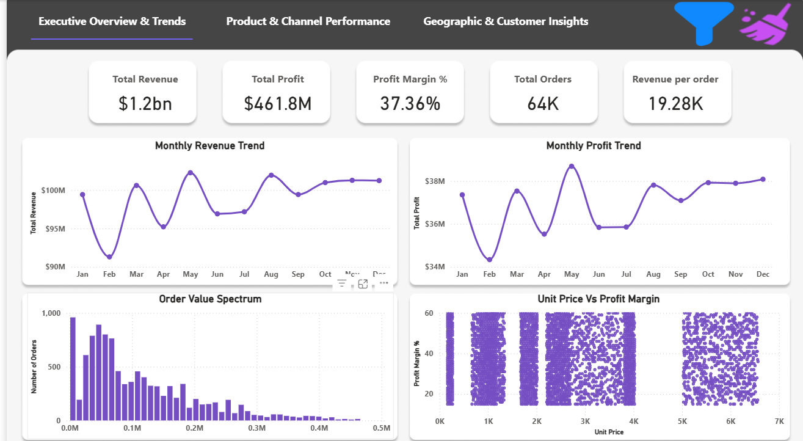
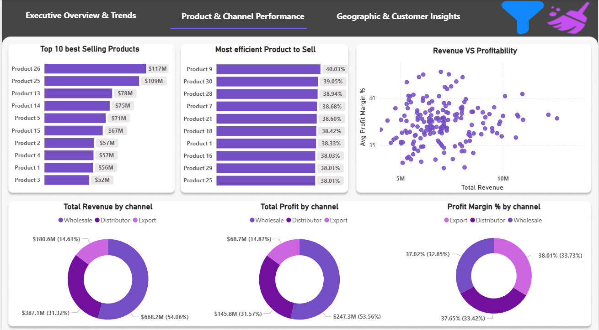
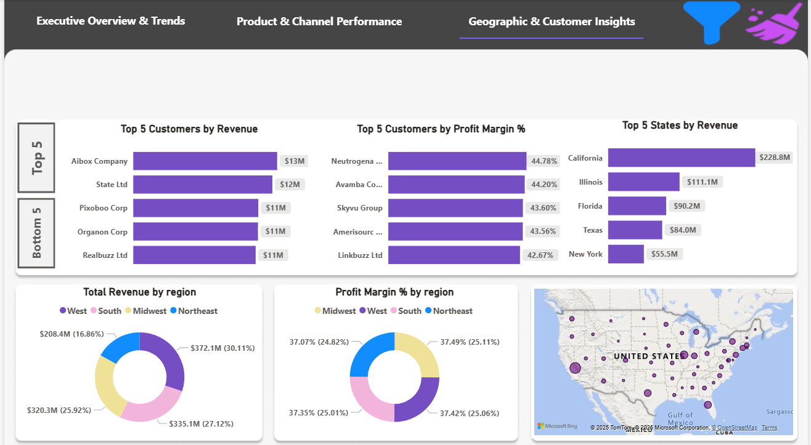

# Regional Sales Performance Analysis with Python & Power BI

## 📌 Project Overview
This project analyzes **regional sales performance across the U.S.** using a combination of **Python for data cleaning & analysis** and **Power BI for interactive dashboards**.  
The goal is to uncover **trends, profitability drivers, seasonal swings, and growth opportunities** from 5 years of historical sales data.  


---

## 🧩 Problem Statement
Sales teams often lack a clear, data-driven understanding of regional performance, making it difficult to identify growth opportunities and optimize resources.  

This project aims to:
- Analyze and visualize regional sales data to uncover trends  
- Evaluate profitability across U.S. regions  
- Support strategic decision-making with actionable insights  

---

## ❓ Guiding Questions
1. Why is revenue and profit performance inconsistent across U.S. regions?  
2. What are the **seasonal swings** in sales and profitability?  
3. Which products drive the most revenue and margin?  
4. How do **sales channels** differ in profitability and performance?  
5. What are the key **growth levers** based on 5 years of historical data?  

---

## ⚙️ Technologies Used
- **Python**  
  - `pandas` – data cleaning & transformation   
  - `matplotlib`, `seaborn` – data visualization   
- **Power BI**  
  - Interactive dashboards and drill-down analysis  

---

## 📂 Folder Structure
```
├── data/                    
│   └── processed/
├── notebook/              
│   └── Regional Sales Analysis.ipynb
├── dashboard/             
│   └── Sales-Analysis.pbix
├── dashboardSnapshots/                 
│   ├── 1_executive_overview.png
│   ├── 2_product_channel.png
│   └── 3_geographic_customer.png
├── README.md               
└── LICENSE                 
```


## 🌐 Live Dashboard
The published Power BI dashboard includes **interactive buttons and slicers**  
that allow users to filter by region, channel, product categories, and more.  

👉 [Click here to explore the live Power BI dashboard](https://app.powerbi.com/view?r=eyJrIjoiYTAwNDYyMTQtOTkxNi00YjI5LTliYjgtMDVkMWJiYzJlY2UyIiwidCI6IjJhYzEyMWViLTg1ZmUtNGQxMC05NTAxLWI1ZjY5ZDUyYmQ1OCJ9)


## 📊 Dashboard Previews

### 1. Executive Overview & Trends

 
Shows overall sales health with KPIs like revenue, profit, margin, and order value trends.

- **Total Revenue:** $1.2bn  
- **Profit Margin:** 37.36%  
- **Revenue per Order:** $19.28K  
- Strong monthly fluctuations highlight **seasonality in sales**.

---

### 2. Product & Channel Performance


Identifies top products, efficient SKUs, and channel-level profitability.

- Top-selling product contributed **$117M** in revenue  
- **Wholesale channel** generated 54% of total revenue, but **Export channels** had more balanced margins  
- High variance observed in **Revenue vs. Profitability** scatter plot  

---

### 3. Geographic & Customer Insights


Breaks down revenue and profitability by customers(Top 5 and Bottom 5), region, and state.

- **California** leads with $228.8M in revenue  
- **Delaware** has least revenue ($1.2M)

- **West and South** regions combined account for 57% of revenue  
- Top customers show clear revenue concentration, signaling **dependency risk**  

---

## 🔘 Interactivity Features

The Power BI dashboards include **interactive filter panels** to enable dynamic exploration:  
- **Year filter**: Select data from 2014–2018  
- **Month filter**: Drill down into seasonal trends  
- **Region filter**: Compare Midwest, Northeast, South, and West  
- **Channel filter**: Analyze performance across Distributor, Export, and Wholesale  
- **Reset button (X)**: Clear all applied filters  

👉 These slicer panels make the dashboards fully interactive, allowing users to customize their analysis on demand.


## 📌 Key Insights
- Revenue is heavily **concentrated** among a few states  
- **Seasonality** significantly impacts both revenue and profitability  
- **Wholesale channel** contributes the largest share of revenue, while **Export channels** are more stable in margins  
- A handful of customers drive a large portion of revenue, creating **risk**  
- **West and South** regions are outperforming others, while opportunities exist in underrepresented regions  

---

---
## 📜 License
This project is licensed under the [MIT License](LICENSE) – feel free to use and adapt with attribution.

